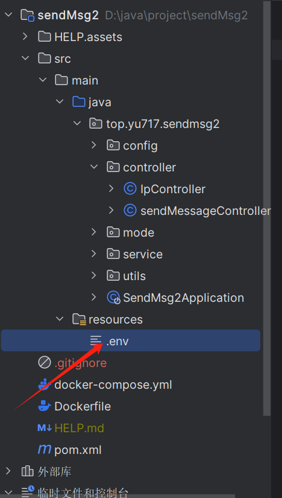

# sendMsg


## 接口示例


调用企业微信发送消息时需要自建.env文件  




文件内容为

```
corpId=*****************  // 企业微信id
corpsecret=*****************  // 企业微信密钥
agentId=********  // 应用id
```


## GET sendMessage

GET /api/send

### 请求参数

| 名称 | 位置  | 类型   | 必选 | 说明 |
| ---- | ----- | ------ | ---- | ---- |
| mag  | query | string | 是   | none |

> 返回示例

```json
"发送成功"
```

### 返回结果

| 状态码 | 状态码含义                                              | 说明 | 数据模型 |
| ------ | ------------------------------------------------------- | ---- | -------- |
| 200    | [OK](https://tools.ietf.org/html/rfc7231#section-6.3.1) | none | string   |

## POST sendMessagePost

POST /api/send_msg

> Body 请求参数

```json
"string"
```

### 请求参数

| 名称 | 位置 | 类型   | 必选 | 说   |
| ---- | ---- | ------ | ---- | :--- |
| body | body | string | 否   | none |

> 返回示例

```json
null
```

### 返回结果

| 状态码 | 状态码含义                                              | 说明 | 数据模型 |
| ------ | ------------------------------------------------------- | ---- | -------- |
| 200    | [OK](https://tools.ietf.org/html/rfc7231#section-6.3.1) | none | string   |

GET /ip/cheng_ip

### 请求参数

| 名称 | 位置  | 类型   | 必选 | 说明                                                         |
| ---- | ----- | ------ | ---- | ------------------------------------------------------------ |
| msg  | query | string | 是   | username  =你的账户  ipv6Addr 你的ipv6地址 ipv6Result  更新域名回调 |

#### 详细说明

**msg**:  username  =你的账户  ipv6Addr 你的ipv6地址 ipv6Result  更新域名回调
http://send2.yu717.top/ip/cheng_ip?msg=xiaoyu,#{ipv6Addr},#{ipv6Result}

> 返回示例

### 返回结果

| 状态码 | 状态码含义                                              | 说明 | 数据模型 |
| ------ | ------------------------------------------------------- | ---- | -------- |
| 200    | [OK](https://tools.ietf.org/html/rfc7231#section-6.3.1) | none | Inline   |

### 返回数据结构

## GET trackIp

GET /ip/{msg}

### 请求参数

| 名称 | 位置 | 类型   | 必选 | 说明                                     |
| ---- | ---- | ------ | ---- | ---------------------------------------- |
| msg  | path | string | 是   | 这里填写ddns-go webhook里的username 访问 |

> 请求示例  http://send2.yu717.top/ip/username


这里的username 和webhook里的对应


> 返回示例

### 返回结果

| 状态码 | 状态码含义                                              | 说明 | 数据模型 |
| ------ | ------------------------------------------------------- | ---- | -------- |
| 200    | [OK](https://tools.ietf.org/html/rfc7231#section-6.3.1) | none | Inline   |


